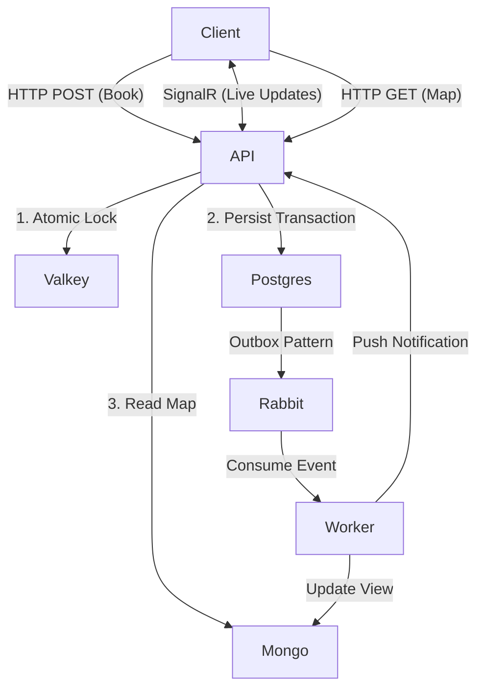
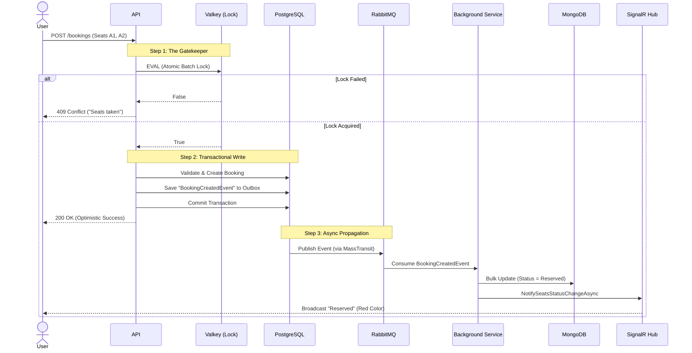
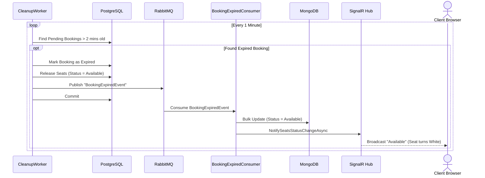

# 🎟️ High-Concurrency Cinema Booking System

A robust, event-driven ticketing system built with **.NET 9**, **CQRS**, and **React**. Designed to handle high-concurrency scenarios (e.g., blockbuster releases) without race conditions, using a "No Luck, No Fate" architecture.


## 🌟 Key Features

*   **"No Luck" Locking:** Uses **Valkey (Redis) + Lua Scripts** for atomic, distributed locking. Zero race conditions.
*   **CQRS Architecture:**
    *   **Write Side:** PostgreSQL (Strict Consistency & Transactional Integrity).
    *   **Read Side:** MongoDB (High-performance Denormalized Views).
*   **Event-Driven:** Uses **MassTransit (RabbitMQ)** with the **Transactional Outbox Pattern** to ensure data consistency.
*   **Real-Time Updates:** **SignalR** pushes live seat availability changes to all connected clients instantly.
*   **Self-Healing:** A background worker automatically cleans up "Zombie Reservations" (expired but unpaid bookings).
*   **Modern Frontend:** React 18, Vite, and **Tailwind CSS v4** with a drag-to-select UI.

---

## 🏗️ Architecture Overview

The system follows **Clean Architecture** principles.



---

## ⚡ Deep Dive: The Flows

### 1. The Booking Flow (Happy Path)
How we handle multiple users trying to book the same seats simultaneously.



### 2. The Cleanup Flow (Zombie Killer)
What happens if a user books but never pays? (Simulated by a 2-minute expiry).



---

## 🛠️ Technology Stack

| Component | Technology | Purpose |
| :--- | :--- | :--- |
| **Backend** | .NET 9 / C# | Core API & Business Logic |
| **Database (Write)** | PostgreSQL 17 | Relational Data & Outbox |
| **Database (Read)** | MongoDB 7.0 | Fast Seat Map Retrieval |
| **Locking** | Valkey 8 (Redis) | Distributed Atomic Locking |
| **Messaging** | RabbitMQ | Event Bus |
| **Orchestration** | MassTransit | Message Abstraction & Outbox |
| **Real-Time** | SignalR | WebSocket Push Notifications |
| **Frontend** | React + Vite | User Interface |
| **Styling** | Tailwind CSS v4 | Styling & Animations |
| **Container** | Docker Compose | Full Stack Orchestration |

---

## 🚀 Getting Started

### Prerequisites
*   **Docker Desktop** (Running)
*   **.NET 10 SDK** (Optional, for local dev)
*   **Node.js 20+** (Optional, for local dev)

### Option A: Run Everything (Docker)
The easiest way to see the demo. This spins up the API, Database, and Frontend.

```bash
# 1. Clone the repo
git clone https://github.com/1nauman/BookingSystem.git
cd BookingSystem

# 2. Run the stack
docker-compose up --build
```

*   **Frontend:** [http://localhost:3000](http://localhost:3000)
*   **Scalar API:** [http://localhost:5000/swagger](http://localhost:5000/scalar)
*   **RabbitMQ UI:** [http://localhost:15672](http://localhost:15672) (guest/guest)

### Option B: Hybrid Dev (Local Code, Docker Infra)
If you want to modify code and see changes instantly.

1.  **Start Infrastructure Only:**
    ```bash
    docker-compose up -d postgres mongo valkey rabbitmq
    ```
2.  **Run Backend:**
    ```bash
    dotnet run --project src/BookingSystem.Api
    ```
3.  **Run Frontend:**
    ```bash
    cd client
    npm install
    npm run dev
    ```

---

## 📂 Project Structure

```text
BookingSystem/
├── client/                 # React Frontend (Vite + Tailwind)
│   ├── src/
│   │   ├── components/     # Seat, CinemaScreen, Modals
│   │   └── types/          # TypeScript interfaces
├── src/
│   ├── BookingSystem.Api/            # Entry Point, Controllers, SignalR Hub
│   ├── BookingSystem.Application/    # Business Logic, Commands, Handlers
│   ├── BookingSystem.Domain/         # Entities, Enums, Events (Pure C#)
│   └── BookingSystem.Infrastructure/ # EF Core, Redis, Mongo, MassTransit
├── tests/                  # Integration Tests
└── docker-compose.yml      # Orchestration
```

---

## 🧪 Testing the "No Luck" Logic

To verify the concurrency handling:

1.  Open the app in **two different browsers** (or Incognito).
2.  Select the **same seats** in both windows.
3.  Click "Confirm Booking" in both windows at the exact same time.
4.  **Result:**
    *   One user will see the "Success" modal.
    *   The other user will get an alert: *"Booking Failed: Seats taken"*.
    *   Both screens will update to show the seats as Reserved (Red/Grey).

---

## 🔮 Future Improvements

*   **Payment Integration:** Hook into Stripe/Razorpay during the `Pending` state.
*   **User Auth:** Add JWT Authentication (Auth0/Identity).
*   **Seat Pricing:** Different prices for VIP/Regular rows.
*   **Define screens & seating layout:** In a multiplex scenario.
*   **Add integration tests:** Implement TestContainers for MongoDB, RabbitMQ, Postgres, etc.; to be able to run tests locally.